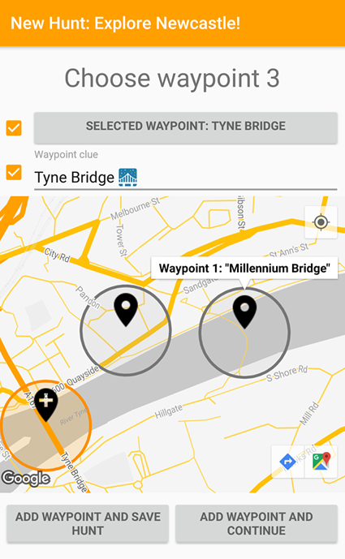
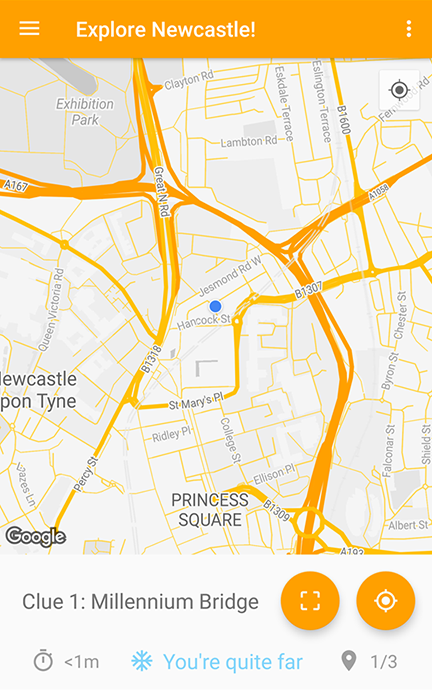
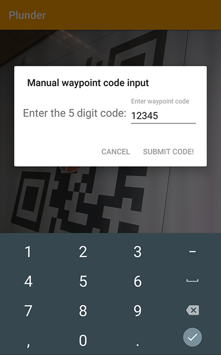
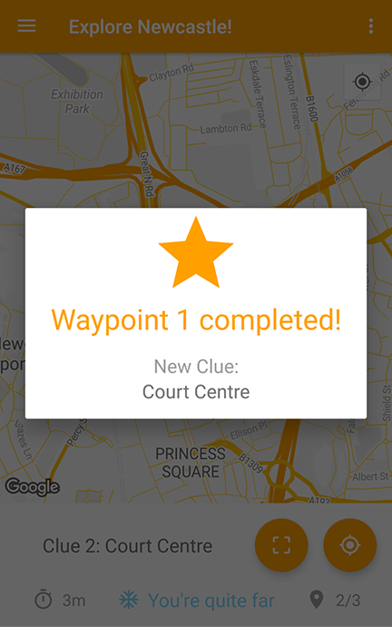

# Welcome to Plunder
Explore the world with user created hunts!

Compete in Plunders against others for rewards and fun!


This repository contains the back-end logic for the Plunder app.
The repository containing the app code, can be found here: [Plunder](https://github.com/SzyJ/Plunder)

## How it works
The logic in the PHP files is used to communicate with a MySQL database that contains all app data. User profiles, created hunts, created Plunders...

</img>
</img>
</img>
</img>

The location and credentials used for the database can be configured in the ```init.php``` file.

## Credit
All .php files have been written by:
* [Yathartha Sharma](https://github.com/yatharthasharma)
* [Guillermo Chibas](https://github.com/guillech)
